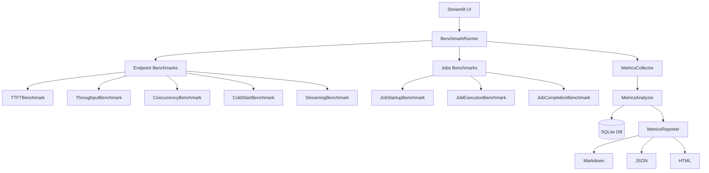

# ⚡ NebiusBench

[](LICENSE)
[](https://python.org)
[](https://streamlit.io)
[](Dockerfile)
[](https://nebius.com)

**Production-grade benchmarking and observability platform for Nebius AI Cloud — Endpoints and Jobs.**

NebiusBench measures TTFT, inter-token latency, throughput, and concurrency scaling across Nebius AI models — then visualizes everything in a professional Streamlit dashboard with real-time charts, run comparison, cost analysis, and downloadable reports.

---

## Architecture



---

## Features

### Endpoint Benchmarking
- **TTFT** — Time-To-First-Token via Server-Sent Events
- **Inter-Token Latency** — Average delay between consecutive output tokens
- **Throughput** — Sustained requests/sec and tokens/sec under load
- **Concurrency Sweep** — Automated sweep across `[1, 5, 10, 25, 50, 100]`
- **Cold Start** — First-request latency after endpoint inactivity
- **Warm Start** — Steady-state p50 latency
- **Percentiles** — p50 / p90 / p95 / p99 for all latency metrics
- **Error tracking** — Per-request error capture and aggregation

### Jobs Benchmarking
- Job creation time
- Queue delay (accepted → RUNNING)
- Container startup time
- Execution time and end-to-end lifecycle

### Streamlit Dashboard
- **Home** — Project overview, architecture diagram, recent runs
- **Run Benchmark** — Interactive config form with real-time progress charts
- **Live Metrics** — Post-run analysis with TTFT distribution, box plots, percentile timelines
- **Compare Runs** — Side-by-side KPI tables, visual charts, delta analysis
- **Cost Analysis** — Per-model pricing, projections, interactive estimator
- **Report Generator** — One-click Markdown / JSON / HTML export with download

### Infrastructure
- **IAM token auth** — auto-fetched from Nebius instance metadata, no credentials stored on disk
- SQLite persistence with SQLAlchemy ORM
- Pydantic v2 models throughout
- Async HTTP with httpx + asyncio
- Docker multi-stage build with non-root user
- Shell scripts for Nebius endpoint/job lifecycle management

---

## Authentication

NebiusBench runs on a **Nebius VM with a service account attached**. The VM automatically receives IAM tokens from the Nebius instance metadata service — no API keys or credential files needed.

```
Nebius VM  →  metadata service  →  IAM token  →  Endpoints + Jobs API
```

For **local development** only, set this environment variable as a fallback:
```bash
export NEBIUS_API_KEY=your_nebius_api_key
```

---

## Prerequisites

- A [Nebius AI Cloud](https://nebius.com) account
- A Nebius VM (CPU is sufficient) with a **service account** attached
  - Service account roles: `ai.models.user`, `ai.jobs.editor`
- Docker and Docker Compose installed on the VM
- SSH access to the VM

---

## Deployment on Nebius VM

### Step 1 — SSH into your VM

```bash
ssh <your-username>@<your-vm-public-ip>
```

### Step 2 — Install Docker

```bash
curl -fsSL https://get.docker.com | sh
sudo usermod -aG docker $USER
newgrp docker
```

### Step 3 — Clone and run

```bash
git clone https://github.com/chinmay4382/nebius-ai-benchmark-suite
cd nebius-ai-benchmark-suite
docker compose up --build -d
```

### Step 4 — Open the dashboard

```
http://<your-vm-public-ip>:8501
```

> Make sure port `8501` is open in your VM's firewall/security group settings in the Nebius console.

That's it — no `.env`, no API key, no extra configuration needed.

---

## Local Development

```bash
# 1. Clone
git clone https://github.com/chinmay4382/nebius-ai-benchmark-suite
cd nebius-ai-benchmark-suite

# 2. Create virtual environment
uv venv
source .venv/bin/activate  # Windows: .venv\Scripts\activate

# 3. Install dependencies
uv pip install -r requirements.txt

# 4. Set API key (local dev fallback only)
export NEBIUS_API_KEY=your_nebius_api_key
export NEBIUS_BASE_URL=https://api.studio.nebius.com/v1

# 5. Run
streamlit run app/Home.py
# Open http://localhost:8501
```

---

## Running a Benchmark

1. Open the dashboard in your browser
2. Go to **Run Benchmark**
3. Set:
   - **Endpoint URL** — `https://api.studio.nebius.com/v1`
   - **Model** — pick from the dropdown (e.g. `Llama 3.1 8B Fast`)
   - **Requests** — start with `50`
   - **Concurrency** — start with `10`
   - **Streaming** — enable for TTFT measurement
4. Click **Run Benchmark**
5. Watch live TTFT charts update in real time
6. View full results in **Live Metrics**, compare runs in **Compare Runs**

---

## CLI Usage

```bash
python -m benchmark.runner \
  --endpoint https://api.studio.nebius.com/v1 \
  --model meta-llama/Meta-Llama-3.1-8B-Instruct-fast \
  --requests 100 \
  --concurrency 10 \
  --streaming
```

---

## Supported Models

| Model | Context | Input $/1M | Output $/1M |
|-------|---------|-----------|------------|
| Llama 3.1 8B (Fast) | 131K | $0.06 | $0.06 |
| Llama 3.1 70B (Fast) | 131K | $0.35 | $0.35 |
| Llama 3.1 405B | 131K | $3.20 | $3.20 |
| Llama 3.3 70B (Fast) | 131K | $0.35 | $0.35 |
| Mistral 7B Instruct | 32K | $0.06 | $0.06 |
| Mixtral 8x7B | 32K | $0.45 | $0.45 |
| Qwen 2.5 72B (Fast) | 131K | $0.35 | $0.35 |
| DeepSeek V3 | 131K | $0.50 | $1.50 |

> Pricing is approximate. See [nebius.com/pricing](https://nebius.com/pricing) for current rates.

---

## Endpoint & Job Management Scripts

```bash
# Create a Nebius AI endpoint
export NEBIUS_FOLDER_ID=your_folder_id
export MODEL=meta-llama/Meta-Llama-3.1-8B-Instruct-fast
./scripts/create_endpoint.sh

# Delete an endpoint
./scripts/delete_endpoint.sh <endpoint-id>

# Submit a job
./scripts/create_job.sh

# Cancel a job
./scripts/delete_job.sh <job-id>
```

---

## Benchmark Methodology

### TTFT Measurement

Measured exclusively in streaming mode via Server-Sent Events:

```python
t_start = time.perf_counter()
async for line in response.aiter_lines():
    if delta.get("content"):
        ttft_ms = (time.perf_counter() - t_start) * 1000
        break
```

### Concurrency Testing

Async semaphores limit simultaneous requests:

```python
semaphore = asyncio.Semaphore(concurrency_level)
tasks = [bounded_request(i) for i in range(request_count)]
results = await asyncio.gather(*tasks)
```

### Statistical Aggregation

```python
p50 = np.percentile(latencies, 50)
p90 = np.percentile(latencies, 90)
p95 = np.percentile(latencies, 95)
p99 = np.percentile(latencies, 99)
```

See [docs/methodology.md](docs/methodology.md) for full details.

---

## Metrics Reference

| Metric | Description |
|--------|-------------|
| **TTFT** | Time from request to first token (streaming only) |
| **ITL** | Average inter-token delay |
| **Throughput** | Requests/sec and tokens/sec under sustained load |
| **Cold Start** | First-request latency after inactivity |
| **Warm Start** | Steady-state p50 latency |
| **Concurrency Scaling** | Latency/throughput curve vs parallel request count |
| **Error Rate** | Fraction of failed requests |
| **Cost/1M Tokens** | Blended input+output cost rate |

See [docs/metrics.md](docs/metrics.md) for interpretation guidance.

---

## Project Structure

```
nebius-ai-benchmark-suite/
├── app/
│   ├── Home.py                    # Landing page
│   ├── ui_utils.py                # Shared UI utilities and chart builders
│   └── pages/
│       ├── 1_Run_Benchmark.py     # Benchmark execution with live charts
│       ├── 2_Live_Metrics.py      # Post-run metrics analysis
│       ├── 3_Compare_Runs.py      # Side-by-side run comparison
│       ├── 4_Cost_Analysis.py     # Cost estimation and projections
│       └── 5_Report_Generator.py  # Report generation and downloads
├── benchmark/
│   ├── auth.py                    # IAM token fetcher (metadata service)
│   ├── models.py                  # Pydantic data models
│   ├── runner.py                  # Main benchmark orchestrator
│   ├── endpoint/                  # Endpoint benchmark implementations
│   ├── jobs/                      # Jobs benchmark implementations
│   ├── metrics/                   # Analysis and reporting
│   └── storage/                   # SQLite persistence layer
├── config/
│   ├── benchmark.yaml             # Benchmark defaults and prompt datasets
│   └── models.yaml                # Model registry with pricing
├── scripts/
│   ├── create_endpoint.sh         # Create a Nebius AI endpoint
│   ├── delete_endpoint.sh         # Delete a Nebius AI endpoint
│   ├── create_job.sh              # Submit a Nebius AI job
│   └── delete_job.sh              # Cancel a Nebius AI job
├── templates/
│   └── report.html.jinja2         # HTML report template
├── docs/
│   ├── architecture.md            # System design
│   ├── methodology.md             # How metrics are measured
│   └── metrics.md                 # Metrics definitions and targets
├── data/                          # SQLite DB and sample results
├── reports/                       # Generated benchmark reports
├── Dockerfile                     # Multi-stage production build
├── docker-compose.yml             # Service orchestration
├── requirements.txt               # Python dependencies
└── .env.example                   # Environment variable reference
```

---

## Cost Estimates

Example for **Llama 3.1 8B** (`$0.06/1M` blended):

| Scale | Daily Requests | Monthly Cost |
|-------|---------------|-------------|
| Small | 1,000/day | ~$0.46/mo |
| Growing | 10,000/day | ~$4.60/mo |
| Production | 100,000/day | ~$46/mo |
| Scale | 1,000,000/day | ~$460/mo |

_(Based on 150 prompt + 256 completion tokens per request)_

---

## Troubleshooting

**Port 8501 not reachable?**
Open port `8501` in your VM's security group in the Nebius console under **Network interface → Security groups**.

**IAM token error on local machine?**
You're not on a Nebius VM. Set `NEBIUS_API_KEY` in your environment as a fallback.

**Docker permission denied?**
```bash
sudo usermod -aG docker $USER && newgrp docker
```

**App not starting after `docker compose up`?**
```bash
docker compose logs app
```

---

## Future Improvements

- [ ] WebSocket / gRPC endpoint support
- [ ] GPU metrics via Nebius monitoring API
- [ ] Prometheus metrics export
- [ ] Scheduled benchmark runs (cron)
- [ ] Multi-region latency comparison
- [ ] A/B testing mode for prompt variations
- [ ] Slack / email alerting on error rate thresholds
- [ ] OpenTelemetry tracing integration

---

## Contributing

1. Fork the repository
2. Create a feature branch (`git checkout -b feat/your-feature`)
3. Commit your changes
4. Push and open a pull request

---

## License

[MIT](LICENSE) — Copyright 2025 NebiusBench Contributors

Built for the **Nebius AI Hackathon** 🚀
