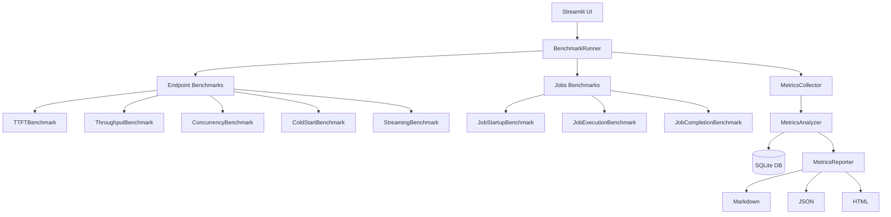

# ⚡ NebiusBench

[](LICENSE)
[](https://python.org)
[](https://streamlit.io)
[](Dockerfile)
[](https://nebius.com)

**Production-grade benchmarking and observability platform for Nebius Serverless AI Endpoints and AI Jobs.**

NebiusBench measures TTFT, inter-token latency, throughput, and concurrency scaling across Nebius AI models — then visualizes everything in a professional Streamlit dashboard with real-time charts, run comparison, cost analysis, and downloadable reports.

---

## Architecture



---

## Features

### Endpoint Benchmarking
- **TTFT** — Time-To-First-Token via Server-Sent Events
- **Inter-Token Latency** — Average delay between consecutive output tokens
- **Throughput** — Sustained requests/sec and tokens/sec under load
- **Concurrency Sweep** — Automated sweep across `[1, 5, 10, 25, 50, 100]`
- **Cold Start** — First-request latency after endpoint inactivity
- **Warm Start** — Steady-state p50 latency
- **Percentiles** — p50 / p90 / p95 / p99 for all latency metrics
- **Error tracking** — Per-request error capture and aggregation

### Jobs Benchmarking
- Job creation time
- Queue delay (accepted → RUNNING)
- Container startup time
- Execution time and end-to-end lifecycle

### Streamlit Dashboard
- **Home** — Project overview, architecture diagram, recent runs
- **Run Benchmark** — Interactive config form with real-time progress charts
- **Live Metrics** — Post-run analysis with TTFT distribution, box plots, percentile timelines
- **Compare Runs** — Side-by-side KPI tables, visual charts, delta analysis
- **Cost Analysis** — Per-model pricing, projections, interactive estimator
- **Report Generator** — One-click Markdown / JSON / HTML export with download

### Infrastructure
- SQLite persistence with SQLAlchemy ORM
- Repository pattern for clean data access
- Pydantic v2 models throughout
- Async HTTP with httpx + asyncio
- Docker multi-stage build with non-root user
- Shell scripts for Nebius endpoint/job management

---

## Quick Start

### Local Setup

```bash
# 1. Clone
git clone https://github.com/nebiusbench/nebiusbench
cd nebiusbench

# 2. Install
pip install -r requirements.txt

# 3. Configure
cp .env.example .env
# Edit .env — set NEBIUS_API_KEY

# 4. Launch
streamlit run app/Home.py
# Open http://localhost:8501
```

### Docker

```bash
cp .env.example .env
# Edit .env with your NEBIUS_API_KEY

docker compose up --build
# Open http://localhost:8501
```

---

## Nebius Setup

### 1. Get your API Key

1. Sign up at [nebius.com](https://nebius.com)
2. Navigate to **AI Studio → API Keys**
3. Create a new key and copy it

### 2. Configure .env

```bash
NEBIUS_API_KEY=your_key_here
NEBIUS_BASE_URL=https://api.studio.nebius.com/v1
```

### 3. Create an Endpoint (optional)

```bash
# Set environment variables first
export NEBIUS_FOLDER_ID=your_folder_id
export MODEL=meta-llama/Meta-Llama-3.1-8B-Instruct-fast

./scripts/create_endpoint.sh
```

### 4. Run a Benchmark via CLI

```bash
python -m benchmark.runner \
  --endpoint https://api.studio.nebius.com/v1 \
  --model meta-llama/Meta-Llama-3.1-8B-Instruct-fast \
  --requests 100 \
  --concurrency 10 \
  --streaming
```

---

## Supported Models

| Model | Context | Input $/1M | Output $/1M |
|-------|---------|-----------|------------|
| Llama 3.1 8B (Fast) | 131K | $0.06 | $0.06 |
| Llama 3.1 70B (Fast) | 131K | $0.35 | $0.35 |
| Llama 3.1 405B | 131K | $3.20 | $3.20 |
| Llama 3.3 70B (Fast) | 131K | $0.35 | $0.35 |
| Mistral 7B Instruct | 32K | $0.06 | $0.06 |
| Mixtral 8x7B | 32K | $0.45 | $0.45 |
| Qwen 2.5 72B (Fast) | 131K | $0.35 | $0.35 |
| DeepSeek V3 | 131K | $0.50 | $1.50 |

> Pricing is approximate. See [nebius.com/pricing](https://nebius.com/pricing) for current rates.

---

## Benchmark Methodology

### TTFT Measurement

TTFT is measured exclusively in streaming mode using Server-Sent Events:

```python
t_start = time.perf_counter()
async for line in response.aiter_lines():
    if delta.get("content"):
        t_first_token = time.perf_counter()  # first non-empty token
        ttft_ms = (t_first_token - t_start) * 1000
        break
```

### Concurrency Testing

Async semaphores control concurrent request count:

```python
semaphore = asyncio.Semaphore(concurrency_level)
tasks = [bounded_request(i) for i in range(request_count)]
results = await asyncio.gather(*tasks)
```

### Statistical Aggregation

NumPy percentiles over all successful request metrics:

```python
p50 = np.percentile(latencies, 50)
p90 = np.percentile(latencies, 90)
p95 = np.percentile(latencies, 95)
p99 = np.percentile(latencies, 99)
```

See [docs/methodology.md](docs/methodology.md) for full details.

---

## Metrics Reference

| Metric | Description |
|--------|-------------|
| **TTFT** | Time from request to first token (streaming only) |
| **ITL** | Average inter-token delay |
| **Throughput** | Requests/sec and tokens/sec under sustained load |
| **Cold Start** | First-request latency after inactivity |
| **Warm Start** | Steady-state p50 latency |
| **Concurrency Scaling** | Latency/throughput curve vs parallel request count |
| **Error Rate** | Fraction of failed requests |
| **Cost/1M Tokens** | Blended input+output cost rate |

See [docs/metrics.md](docs/metrics.md) for interpretation guidance.

---

## Cost Estimates

Example for **Llama 3.1 8B** (`$0.06/1M` blended):

| Scale | Daily Requests | Monthly Cost |
|-------|---------------|-------------|
| Small startup | 1,000/day | ~$0.46/mo |
| Growing app | 10,000/day | ~$4.60/mo |
| Production | 100,000/day | ~$46/mo |
| Scale | 1,000,000/day | ~$460/mo |

_(Based on 150 prompt + 256 completion tokens per request)_

---

## Project Structure

```
nebiusbench/
├── app/
│   ├── Home.py                    # Landing page
│   ├── ui_utils.py                # Shared UI utilities
│   └── pages/
│       ├── 1_Run_Benchmark.py     # Benchmark execution
│       ├── 2_Live_Metrics.py      # Real-time metrics
│       ├── 3_Compare_Runs.py      # Run comparison
│       ├── 4_Cost_Analysis.py     # Cost analysis
│       └── 5_Report_Generator.py  # Report generation
├── benchmark/
│   ├── models.py                  # Pydantic data models
│   ├── runner.py                  # Main orchestrator
│   ├── endpoint/                  # Endpoint benchmarks
│   ├── jobs/                      # Jobs benchmarks
│   ├── metrics/                   # Analysis & reporting
│   └── storage/                   # SQLite persistence
├── config/
│   ├── benchmark.yaml             # Benchmark defaults
│   └── models.yaml                # Model registry + pricing
├── scripts/
│   ├── create_endpoint.sh
│   ├── delete_endpoint.sh
│   ├── create_job.sh
│   └── delete_job.sh
├── templates/
│   └── report.html.jinja2         # HTML report template
├── data/                          # SQLite DB + sample data
├── reports/                       # Generated reports
├── docs/                          # Documentation
├── Dockerfile
├── docker-compose.yml
├── requirements.txt
└── .env.example
```

---

## Future Improvements

- [ ] WebSocket / gRPC endpoint support
- [ ] GPU metrics via Nebius monitoring API
- [ ] Prometheus metrics export
- [ ] Scheduled benchmark runs (cron)
- [ ] Multi-region latency comparison
- [ ] A/B testing mode for prompt variations
- [ ] Slack / email alerting on error rate thresholds
- [ ] OpenTelemetry tracing integration

---

## Contributing

1. Fork the repository
2. Create a feature branch
3. Add tests for new benchmark types
4. Submit a pull request

---

## License

[MIT](LICENSE) — Copyright 2025 NebiusBench Contributors

Built for the **Nebius AI Hackathon** 🚀
